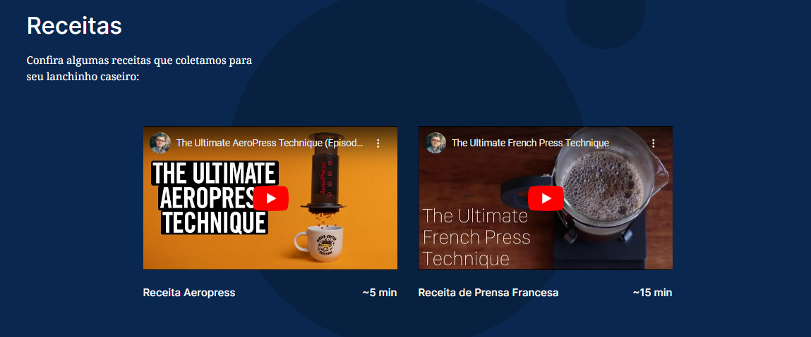
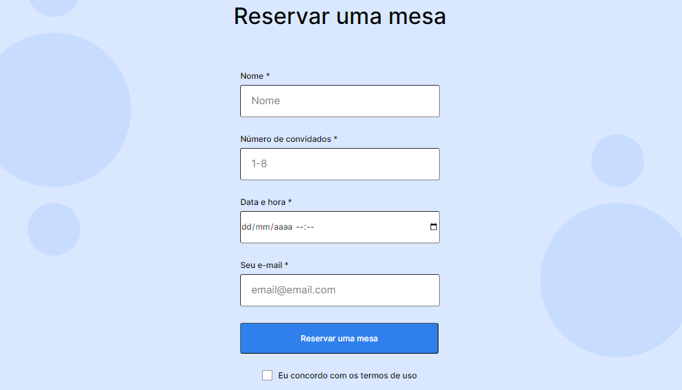
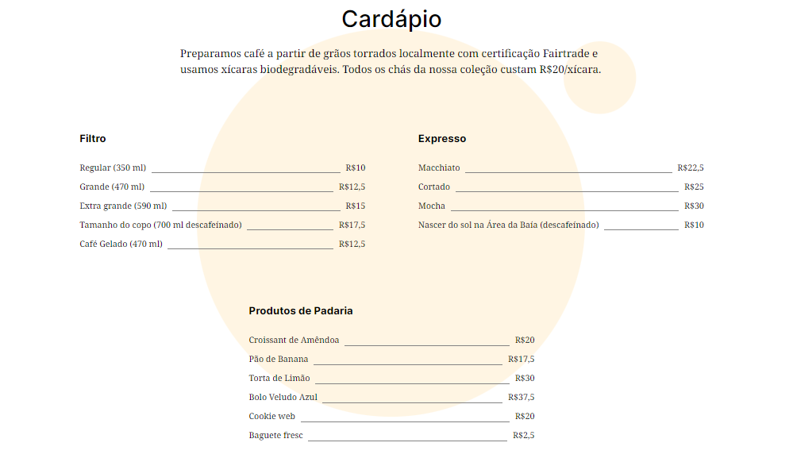

# Triple Espresso

Nome: Coffee Shop Triple Espresso

O projeto é uma página web para uma Coffee Shop, com algumas funcionalidades interessantes, como:

- Vídeos sobre como preparar tipos de cafés;
- Formulário para reservar uma mesa na cafeteria;
- Cardápio;
  etc.

HTML e CSS foram as tecnologias usadas para o desenvolvimento.

Melhorias futuras:

- Cardápio e vídeos em formato de carrosel;
- Formulário com mais funcionalidades;
- Mapa do local e como chegar lá;
  etc.

Feito por Yuri Loureiro.

Algumas imagens da página:

Receitas

Formulário

Cardápio

